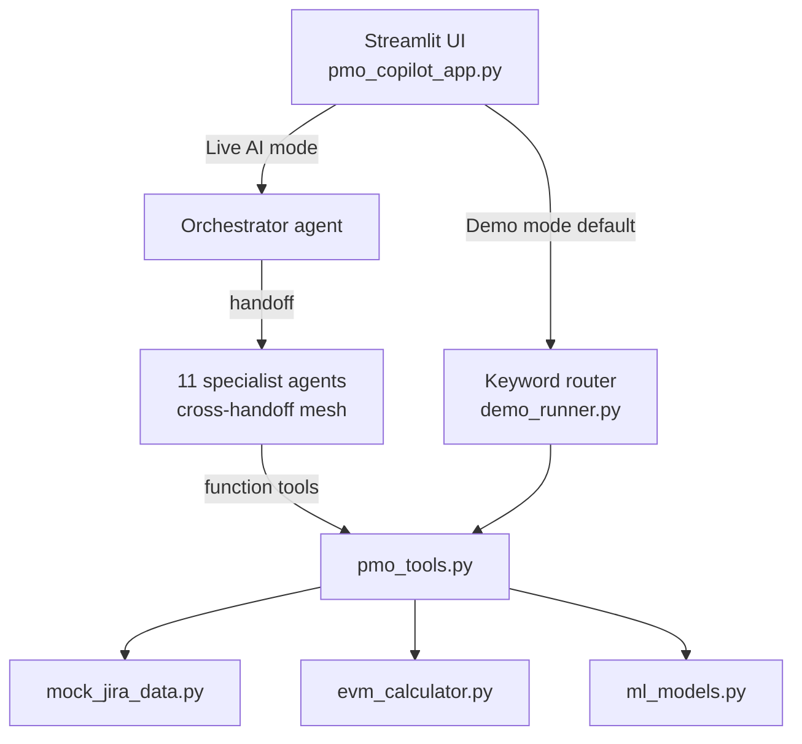

# PMO Agentic Copilot

A multi-agent project-portfolio management assistant: an orchestrator agent routes natural-language PMO queries to eleven specialist agents (status reporting, risk, escalation, EVM, scheduling, resources, milestones, forecasting, workflow), built on the OpenAI Agents SDK with a Streamlit front end.

It is aimed at PMO leads and delivery managers who want status reports, Red/Amber/Green dashboards, Earned Value Management analysis, escalation packs, and steering-committee material generated from portfolio data on demand. The repository ships with a four-project mock portfolio and a fully offline demo mode, so it runs end to end without any API key.

## Architecture at a glance

- **Orchestration pattern: triage router with a peer handoff mesh.** A front-door orchestrator agent (`pmo_copilot_agents.py`) routes each query to one of 11 specialist agents via OpenAI Agents SDK `handoff()`. Specialists are additionally wired to each other (3–5 handoffs each), so control can chain laterally — e.g. Risk Prediction → EVM Analyst → Escalation — without returning to the orchestrator. Execution is sequential: exactly one agent is active at a time, running a single-agent tool loop until it answers or hands off. Nothing runs in parallel.
- **Framework and model:** OpenAI Agents SDK (`openai-agents`). No model is pinned in code; the SDK default is used. A second, LLM-free path (`demo_runner.py`) routes queries by keyword matching and calls the same tool functions directly — this is the default mode.
- **Tools:** 14 read-only functions in `pmo_tools.py` (portfolio overview, project details, blockers, risks, EVM, sprints, issues, escalation report, schedule, resources, milestones, predictive analytics, workflow, ML predictions). The agents expose 14 `@function_tool` wrappers: 13 of these functions (all but ML predictions) plus a current-date helper.
- **Memory / session state:** none on the agent side — each query is an independent `Runner.run()` with no conversation history. Streamlit `st.session_state` keeps chat history and the last report for display only.
- **Retrieval:** none. Data comes from in-process Python dictionaries (`mock_jira_data.py`); LangChain/FAISS/Chroma appear in `requirements.txt` but are not used by any module.
- **Analytics:** deterministic EVM math (`evm_calculator.py`) and five lazily trained regression/classification models (`ml_models.py`) with graceful fallbacks when scikit-learn or XGBoost are absent.



See [docs/ARCHITECTURE.md](docs/ARCHITECTURE.md) for the full component map and data flow.

## Quickstart

```bash
git clone https://github.com/git-bonda108/PMO_CoPIlot.git
cd PMO_CoPIlot

python -m venv venv
source venv/bin/activate          # Windows: venv\Scripts\activate

pip install -r requirements.txt
pip install scikit-learn xgboost  # optional: enables the trained ML models (not in requirements.txt)

streamlit run pmo_copilot_app.py
```

Expected output:

```
  You can now view your Streamlit app in your browser.

  Local URL: http://localhost:8501
```

The app opens in Demo Mode (no keys needed). Click an agent in the sidebar or type a query such as `escalate DPLAT` or `rag dashboard`.

Two console entry points also exist:

```bash
python demo_runner.py           # interactive demo REPL, no API key
python pmo_copilot_agents.py    # interactive session against the live agents (requires OPENAI_API_KEY)
```

## Configuration

Environment variables are loaded from a `.env` file in the project root via `python-dotenv` (`.env` is gitignored).

| Variable | Required | What it does | Where to get it |
|----------|----------|--------------|-----------------|
| `OPENAI_API_KEY` | No | Enables Live AI Mode. The app checks that the value starts with `sk-`; without it, everything runs in Demo Mode. | platform.openai.com |
| `ANTHROPIC_API_KEY` | No | Read by the app (`pmo_copilot_app.py`) but not used by any current code path. | Not needed |

No model-selection variable is read by the code; agents use the SDK's default model.

## Modes

| Mode | What runs | API key |
|------|-----------|---------|
| Demo Mode (default) | Keyword router in `demo_runner.py` calls tool functions directly; deterministic output | None |
| Live AI Mode (sidebar toggle) | `Runner.run()` on the orchestrator agent; falls back to Demo Mode on any API error | `OPENAI_API_KEY` |

## Repository layout

```
pmo_copilot_app.py       Streamlit UI (8 tabs: assistant, portfolio, deep dive,
                         risks, EVM, visualizations, ML predictions, reports)
pmo_copilot_agents.py    Orchestrator + 11 specialist agents and their handoffs
pmo_tools.py             14 tool functions shared by agents and demo mode
demo_runner.py           Offline keyword router simulating the agent flow
ml_models.py             5 predictive models (cost, schedule, risk, resources, burn rate)
evm_calculator.py        Earned Value Management calculations and report formatting
mock_jira_data.py        Four-project mock portfolio (ECOM, MAPP, DPLAT, SECU)
requirements.txt         Python dependencies
*.xlsx, *.pdf            Sample data exports and briefing documents
```

## Documentation

- [Architecture](docs/ARCHITECTURE.md) — component map, orchestration analysis, state, design trade-offs
- [Evaluation](docs/EVALUATION.md) — what is and is not tested, known defects, proposed harness
- [Hardening](docs/HARDENING.md) — current security posture and a staged path to production
- [Features and workflows](PMO_COPILOT_FEATURES_WORKFLOW.md) — per-agent feature notes
- [Manual test cases](PMO_COPILOT_TEST_CASES.md) — manual QA catalog (TC-001 … TC-020)

## License

No license file is present; all rights reserved by default.
